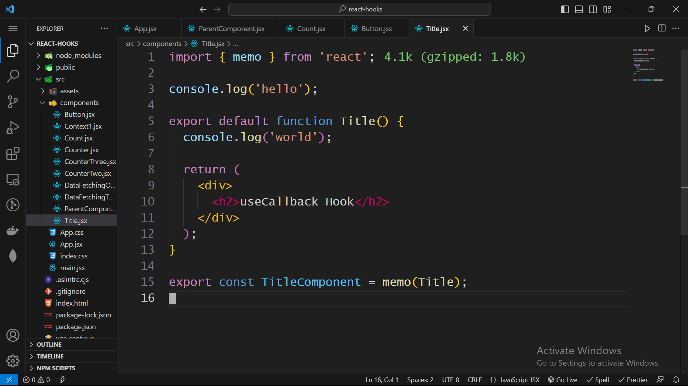

# Remove Console Log

> VSCode Extension for removing console logs from your current file

Thanks for checking out this VSCode extension. If you have any suggestion or have found out any bug please inform me.

If this extension helps you out, give me 🌟🌟🌟🌟🌟 [five-star rating! →](https://marketplace.visualstudio.com/items?itemName=c0der-himel.remove-console-log&ssr=false#review-details) 😃

## How to use it

It's very simple. It's just 3 step process.

0. This is a demo file
   
1. Press F1
   
2. Type -> remove console log
   
3. Press Enter
   

All console logs will be removed from your current file. And also a notification will popup to show you about removing the console logs.

😁 easy-peasy 😎

## Issues & Suggestions

For any issues or suggestions, please use [GitHub issues](https://github.com/c0der-himel/remove-console-log/issues).
